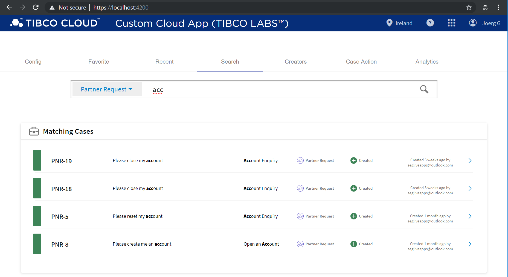

# Documentation 
#### How to create an Angular App from scratch
How to create a new App using Angular CLI from our Cloud Starter Component Library Template.

> Note: This is currently under restricted early access, please get in contact with us via GitHub and we provide you access.

##### Step 1) Install Node & NPM
Node.js and [pkg install ](https://www.npmjs.com/get-npm)

##### Step 2) Install GIT
Installers here https://nodejs.org/en/download/ or just use

```bash
git --version
```

##### Step 3) Install Angular

```bash
npm install -g @angular/cli
```

##### Step 4) Set Git User (and Pass)
ask us to provide you early access and Configure your GitHub Credentials

```bash
git config --global user.email "<your_email>"
git config --global user.name "<your_password>"
git config credential.helper store
```

> we well change this to use public NPM soon.

##### Step 5) Get the package into NPM
load package from GitHub

```bash
npm install -g git+https://github.com/TIBCOSoftware/TCST-Angular/cloud-starter-application-template.git
```

> we well change this to use public NPM soon.

##### Step 6) Create a new application:

```bash
ng new --collection=@TIBCO/cloudapp MyCloudStarter
```

##### Step 7) Go to the Folder and Start and test the app:

```bash
cd MyCloudStarter
ng serve --proxy-config proxy.conf.prod.json --ssl true --source-map
```

or just ...

```bash
npm run serve
```

The App typically runs on http://localhost:4200/



