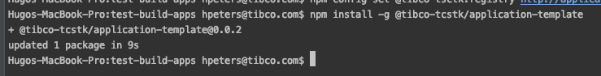
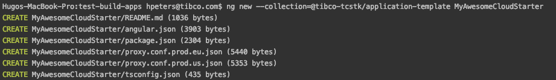
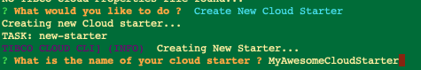
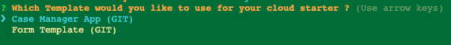
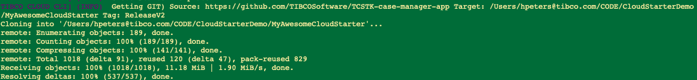
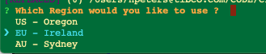
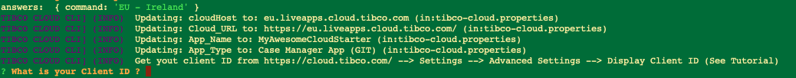
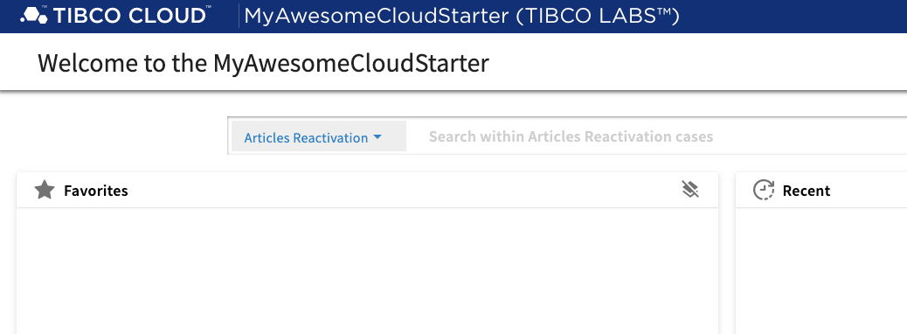

# Documentation 
### How to create an Angular App from scratch in 3 simple steps
How to create a new App using Angular CLI from our Cloud Composer Component Library Template.

### Use Cloud Composer Template from NPM

#### Step 1) Install TIBCO Cloud CLI on a global level
Use the Node Package Manger(NPM) to install the TIBCO Cloud CLI and it's depencency GULP on a global level:

```bash
npm install -g @tibcosoftware/cloud-cli
```



#### Step 2) Build App
Build a new cloud starter using the Cloud CLI

There are 2 ways of doing this; interactive and non-interactive. 

##### a) the Interactive Option
Your first option is to start the cloud cli and go through the interactive menu.
In this example we just start the cloud cli, in a folder where you want to create the new cloud starter, as follows:

```bash
tcli
```



Select Create New Cloud Starter; and give it a name:



Select the Case Manager App Template:



And now you see the starter being created:



Choose the TIBCO Cloud Region that you are using:



Now enter the client ID that you can get from the TIBCO Cloud Webpage



Then enter your TIBCO Cloud User name and Password. Note: You can also leave the password blank so it won't be stored; but then you have to enter it each time you start the Cloud CLI.
Then the NPM packages will be installed and eventually you will see this message:


##### b) the command line Option
Your second option is provide the name of your cloud starter and the template to use on the command line, for example:
```bash
tcli new MyAwesomeCloudStarter -t "Case Manager App (GIT)"
```

#### Step 3) Start App
No you can go into Cloud Starter folder and start it up

```bash
cd MyAwesomeCloudStarter/
tcli start
```

Now you can reach your Cloud Starter App on:  https://localhost:4200/



