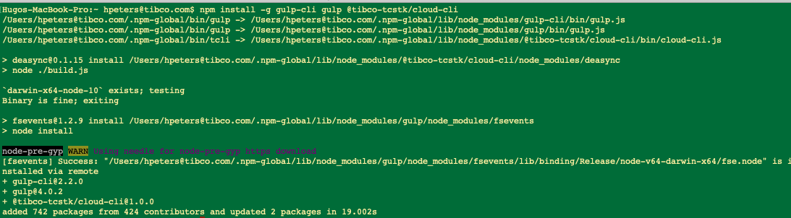
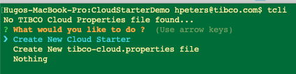

# Documentation 
### How to create an Angular App from scratch
How to create a new App using Angular CLI from our Cloud Starter Component Library Template.

> Note: This is currently under restricted early access.

### Use Schematic Template from NPM

#### Step 1) private NPM Server 
Set the registry to the currently private TIBCO Cloud Starter NPM server, for the @tibco-tsctk scope:

```bash
npm config set @tibco-tcstk:registry http://application-lb-npm-1392137160.eu-west-1.elb.amazonaws.com/
```

!!! info
    This Step will be removed, as soon we use the public common NPM Service.


#### Step 2) Install TIBCO Cloud CLI on a global level
Use the Node Package Manger(NPM) to install the TIBCO Cloud CLI and it's depencency GULP on a global level:

```bash
npm install -g gulp-cli gulp @tibco-tcstk/cloud-cli
```



#### Step 3) Build App
Build a new cloud starter using the Cloud CLI

There are 2 ways of doing this; interactive and non-interactive. Your first option is to start the cloud cli and go through the interactive menu or your second option is provide the name of your cloud starter and the template to use on the command line, for example:
```bash
tcli new MyAwesomeCloudStarter -t TCSTK-case-manager-app
```
In this example we will use the second way, start the cloud cli, in a folder where you want to create the new cloud starter, as follows:

```bash
tcli
```



and eventually:


#### Step 4) Start App
Go into Cloud Starter folder and start it up

```bash
cd MyAwesomeCloudStarter/
npm run serve_eu
```

Now you can reach your Cloud Starter App on:  https://localhost:4200/


