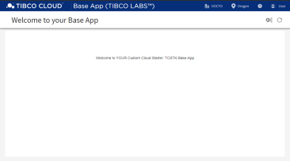
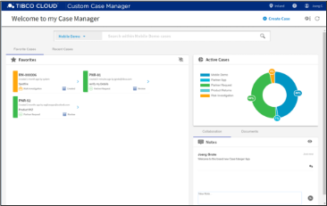
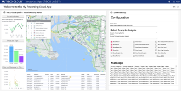
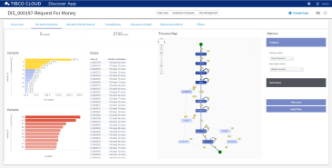

### available Pattern Apps

Pattern Apps are Pre-built applications connected with one or more TIBCO Cloud Service Offerings as a ready to use Solution Template and available as Source for Developers on GitHub and NPM.

#### Base App

App contains the essentials for you to build your TIBCO Cloud solution from scratch, including authorization and navigation to standard configuration options.

- [Pattern App Details](https://tibcosoftware.github.io/TCSToolkit/Angular/starters/TCSTK-base-app/readme/) 
- [Git Source](https://github.com/TIBCOSoftware/TCSTK-base-app/)

#### Case Manager App

App contains all kind of Case Management Features like Case Search, Case Details, Case Actions, Audit Trails, Case Notes, Collaboration, etc. This Pattern App is very TIBCO Cloud LiveApps centric.

- [Pattern App Details](https://tibcosoftware.github.io/TCSToolkit/Angular/starters/TCSTK-case-manager-app/readme/) 
- [Git Source](https://github.com/TIBCOSoftware/TCSTK-case-manager-app/)

#### Analytics App

App contains Analytics Features like open a Dashboard, get selected Data from the Dashboard, etc. This Pattern App is very TIBCO Cloud Spotfire centric.

- [Pattern App Details](https://tibcosoftware.github.io/TCSToolkit/Angular/starters/TCSTK-analytics-app/readme/) 
- [Git Source](https://github.com/TIBCOSoftware/TCSTK-analytics-app/)

#### Discover App

The Process Mining App allows Analysts to discover, learn, improve, and predict process behaviors based on event log data produced by operational systems.
App is not available as a reusable Template, yet!

- [Project Discover Details](https://tibcosoftware.github.io/labs-discover/) 

### More?

Watch out for very soon upcoming additional Apps:

- Messaging App ... as a real-time Client 

> more to be added over time.

