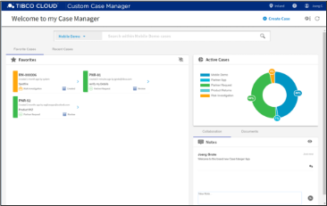

### available Pattern Apps

Pattern Apps are Pre-built applications connected with one or more TIBCO Cloud Service Offerings as a ready to use Solution Template and available as Source for Developers on GitHub and NPM.

#### Case Manager App

App contains all kind of Case Management Features like Case Search, Case Details, Case Actions, Audit Trails, Case Notes, Collaboration, etc. This Pattern App is very TIBCO Cloud LiveApps centric.

- [Pattern App Details](/Angular/starters/TCSTK-case-manager-app/readme/) 
- [Git Source](https://github.com/TIBCOSoftware/TCSTK-case-manager-app/)

### More?

Watch out for very soon upcoming additional Apps:

- Base App ... just containing a few empty Views
- Messaging App ... as a real-time Client 

> more to be added over time.

