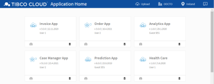

### available Pattern Apps

Pattern Apps are Pre-built applications connected with one or more TIBCO Cloud Service Offerings as a ready to use Solution Template and available as Source for Developers on GitHub and NPM.

To preview Pattern Apps with in your Subscription, try our <b>Pattern App Library</b>. 
Just enter your target Region and target LiveApps Subscription oAuth Key.

<a href="https://www.labs.tibcocloud.com/apps/StartersLibrary/index.html"></img></a>

> We offer as well a preview mode, so that you can see what we have in the Library.

#### Home App
You created multiple custom Web Applications, and you host them as TIBCO Cloud Live Apps Web Resources?
In this case, this Home App can provide you easy access and simple upload/delete functionalities.

> This App is available via Pattern App Library - quick and easy to install, see above! 

#### Base App
App contains the essentials for you to build your TIBCO Cloud solution from scratch, including authorization and navigation to standard configuration options.

- [Pattern App Details](https://tibcosoftware.github.io/TCSToolkit/Angular/starters/TCSTK-base-app/readme/) 
- [Git Source](https://github.com/TIBCOSoftware/TCSTK-base-app/)

#### Case Manager App
App contains all kind of Case Management Features like Case Search, Case Details, Case Actions, Audit Trails, Case Notes, Collaboration, etc. This Pattern App is very TIBCO Cloud LiveApps centric.

- [Pattern App Details](https://tibcosoftware.github.io/TCSToolkit/Angular/starters/TCSTK-case-manager-app/readme/) 
- [Git Source](https://github.com/TIBCOSoftware/TCSTK-case-manager-app/)

#### Analytics App
App contains Analytics Features like open a Dashboard, get selected Data from the Dashboard, etc. This Pattern App is very TIBCO Cloud Spotfire centric.

- [Pattern App Details](https://tibcosoftware.github.io/TCSToolkit/Angular/starters/TCSTK-analytics-app/readme/) 
- [Git Source](https://github.com/TIBCOSoftware/TCSTK-analytics-app/)

#### Discover App
The Process Mining App allows Analysts to discover, learn, improve, and predict process behaviors based on event log data produced by operational systems. 
This App is not available as a reusable NPM Template, yet!

- [Project Discover Details](https://tibcosoftware.github.io/labs-discover/) 

### More?
Watch out for very soon upcoming additional Apps:

- Messaging App ... as a real-time Client 

> more to be added over time.
