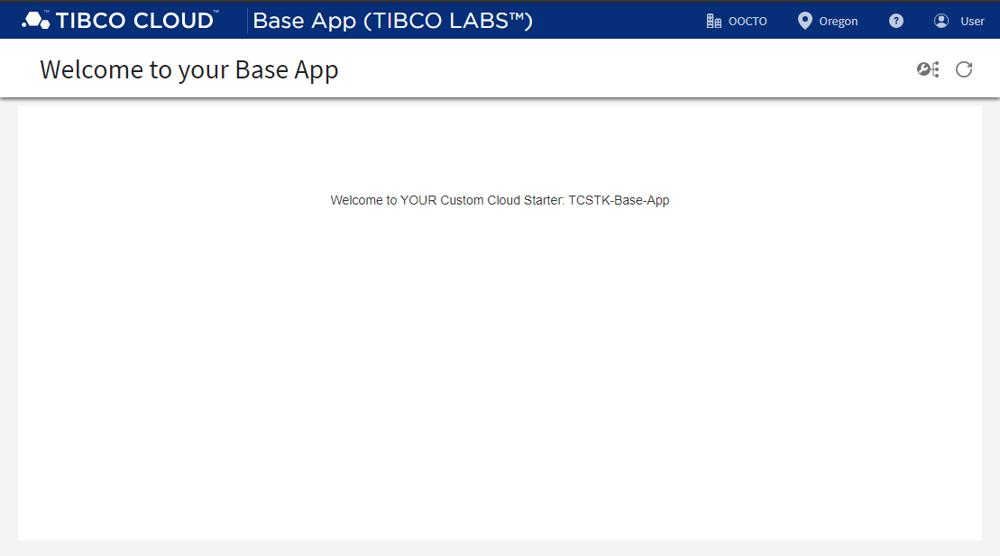

### Starters Toolkit for TIBCO Cloud™ - Base App
TCSTK Pattern - Base App, is a sample that just contains Core TIBCO Cloud Components.

The Pattern application **Base App**, contains the essentials for you to build your TIBCO Cloud solution from scratch, including authorization and navigation to standard configuration options.

**Note** 
This Pattern App is using some Services Offerings of the TIBCO Cloud LiveApps Subscription, e.g. Shared State to store Application Configurations.
Also if the App should be hosted on TIBCO Cloud, a TIBCO Cloud LiveApps Subscription is needed to upload the App to the Web Resource Provisioning Service.

# License
Copyright © 2020. TIBCO Software Inc. 
This file is subject to the license terms contained in the license file that is distributed with this file. Please see tpc.txt for details of license and dependent third party components referenced by this library.
