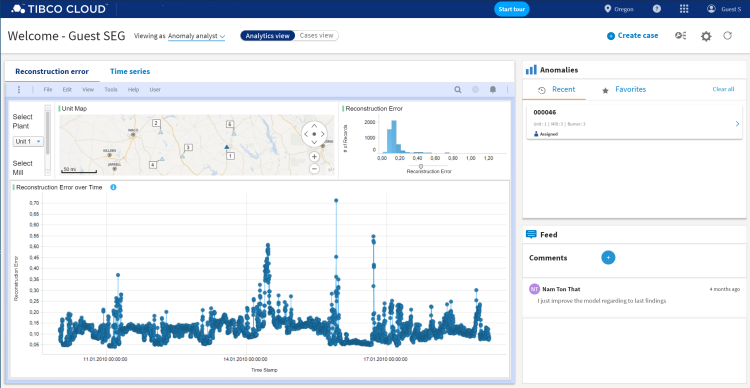

# Pattern Application
### Actionable Dashboard App
A TIBCO Cloud Spotfire Dashboard showing TIBCO Cloud LiveApps cases and related data. Mashed up with process, notes, documents so that a user can mark data in Spotfire and then run an action on the selected "case" context. 
A process implementation could be "contact customer" or a case creator like "investigation". All Process forms would be rendered in same UI.

#### Showcase

#### How to provision

Lorem ipsum dolor sit amet, consetetur sadipscing elitr, sed diam nonumy eirmod tempor invidunt ut labore et dolore magna aliquyam erat, sed diam voluptua. At vero eos et accusam et.
