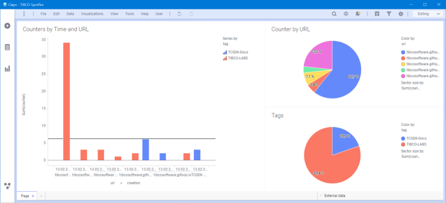
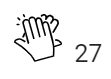
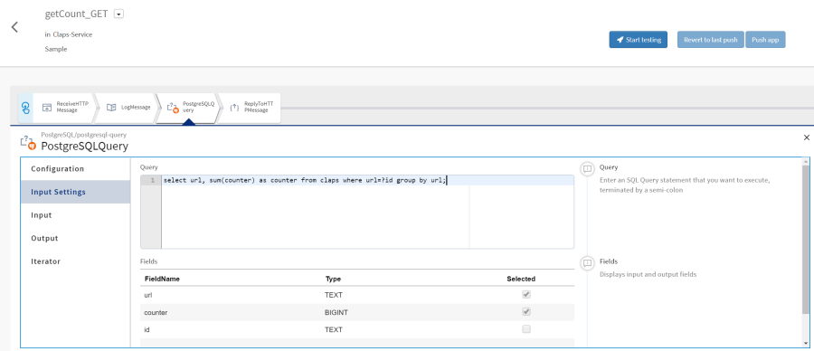
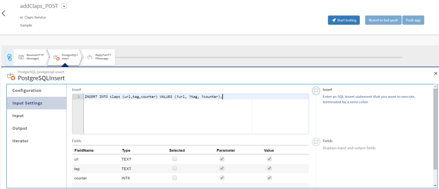

## Claps Element
The Component allows to give an Applause by using Claps to any Webpage.
Thereby the Component it self use his Location URL to count the Claps.

All Claps submitted to the Microservice with a delay of 2 Seconds, this is to not send each Clap one by one.

With a Reporting Dashboard using TIBCO Spotfire connected to underlying PostgreSQL Database Table it is easily to see there are to best Pages in Time, as Timestamps stored as well.

Using the Tags Attribute Pages can be even bundle for a Report. 

#### Screenshot
Screenshot Image as PNG or animated GIF





#### Usage
usage HTML Tags

```html
<tc-claps tags="TCSDK-Docs" size="1"></tc-claps>
<script type="text/javascript" src="https://tibcosoftware.github.io/TCST-Docs/Angular/starters/z-claps-element/element/claps.js"></script> 
```

#### Inputs
available Attributes

| Attribute       | Type            | Default Value | Comments                           |
| --------------- |:--------------- |:------------- |:---------------------------------- |
| tags            | string          | none          | Option to bundel Claps for Reports |
| size            | integer         | 1             | Component Size                     |

#### Demos
live Showcase

<tc-claps tags="TCSDK-Docs" size="1"></tc-claps>
<script type="text/javascript" src="../element/claps.js"></script>

> Showcase connected to real TCI Flogo Service

### Microservice Operations
All Operations implemented using TIBCO Flogo connected to a PostgreSQL Database

#### GET Claps
get latest Claps Count by summarize all records for the same URL.

Full TIBCO Cloud Flogo Service Implementation can be downloaded [here](Flogo-Claps-Service.zip).



#### POST Claps
adds one or multiple Claps to a URL, by inserting a new Record to the Table.



### Database Table
the underlying Table is easy and quick, and stores just the URL of the Component location, plus newly added Counter, the provided Tag (Optional), and an auto-generated timestamps for the Insert.

```sql
create table claps(
  url text not null,
  counter bigint not null,
  tag text,
  creation timestamp default current_timestamp)
;
```
> Cloud hosted PostgreSQL Database for this Showcase, no 24*7 operation availability!  

### Source
All Source on GitHub here: [github.com/TIBCOSoftware/TCST-Angular/projects/starters/z-claps-element/src](https://github.com/TIBCOSoftware/TCST-Angular/projects/starters/z-claps-element/src)
