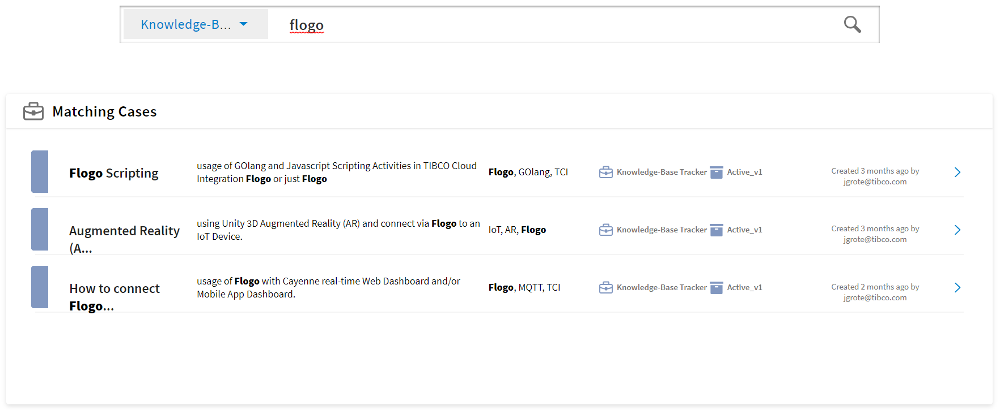

## Case Search Component
Component allows to Search for Case Instances by Application Type. Search Strings get automatically highlighted.

#### Screenshot
Screenshot Image of the Case Search Dialog



#### Usage

```html
<tcla-live-apps-case-search></tcla-live-apps-case-search>
```

#### Inputs
available input Attributes

| Attribute       | Type            | Default Value | Comments                  |
| --------------- |:--------------- |:------------- |:------------------------- |
| sandboxId       | number          |               | LiveApps Sandbox ID       |

#### Outputs
available output Attributes

| Attribute       | Type            | Default Value | Comments                  |
| --------------- |:--------------- |:------------- |:------------------------- |
| foundRefs       |                 |               | Search Result             |

#### Demos
live Showcase

<tcla-live-apps-case-search></tcla-live-apps-case-search>
<script type="text/javascript" src="http://host/cust-component/cust-element.js"></script>

> Showcase connected to Mock Service
