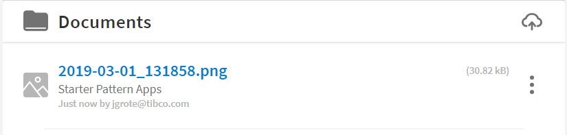

## Documents Component
This Component allows to list, upload, download, view Documents attached to a Case-Instance or a whole Application.

#### Screenshot
Screenshot Image of the Documents Component.



#### Usage
usage HTML Tags

```html
<tcla-live-apps-documents [sandboxId]="31" [folderType]="orgFolders" [folderId]="1" folderDescription="Sample"></tcla-live-apps-documents>
```

> needs 'LiveAppsDocumentUploadDialogComponent' to allow uploads via Drag'n Drop. 

#### Inputs
available Attributes

| Attribute         | Type                          | Default Value | Comments                    |
| ----------------- |:----------------------------- |:------------- |:--------------------------- |
| sandboxId         | number                        |               | current Sandbox ID          |
| folderType        | 'orgFolders' or 'caseFolders' |               | Docs Folder Type            |
| folderId          | caseRef for caseFolder        |               | Folder ID, case or Org.     |
| filter            | string                        | Optional      | optional Filter of Docs     |
| folderDescription | string                        | Optional      | Description displayed       |


#### Demos
live Showcase

```html
<!-- as HTML within Markdown, just remove the ```html code-area ``` -->
<tcla-live-apps-documents [sandboxId]="31" [folderType]="orgFolders" [folderId]="1" folderDescription="Sample"></tcla-live-apps-documents>
<script type="text/javascript" src="http://host/cust-component/tcla-live-apps-documents.js"></script>
```

> Showcase connected to Mock Service


