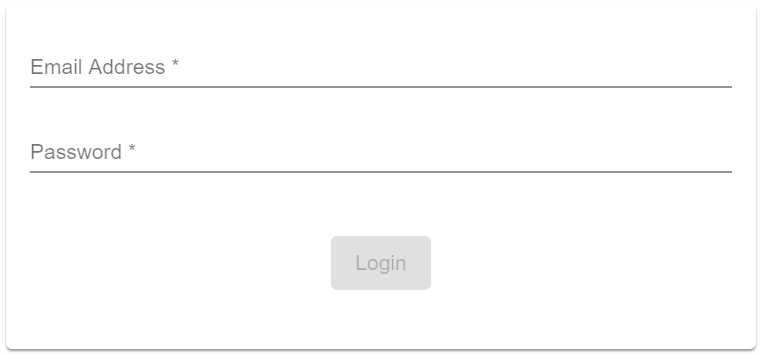

## Login Component
Component perfrom a Login in case there is no valid Session yet.

#### Screenshot
Screenshot Image of the Login Dialog



#### Usage
to place a Login Dialog inside your App just use the following HTML Tag:

```html
<tcla-live-apps-login></tcla-live-apps-login>
```

If the user is not logged in the login component will be displayed automatically.
In Case the user is in multiple subscriptions - they must select a subscription to complete login.

#### Outputs
available Attributes

| Attribute       | Type            | Default Value | Comments                  |
| --------------- |:--------------- |:------------- |:------------------------- |
| loginContext    | LoginContext    |               | valid Session after login |
| loggedIn        | boolean         | false         | indicate valid Session    |

#### Demos
live Showcase

<tcla-live-apps-login></tcla-live-apps-login>
<script type="text/javascript" src="http://host/cust-component/cust-element.js"></script>

> Showcase connected to Mock Service
