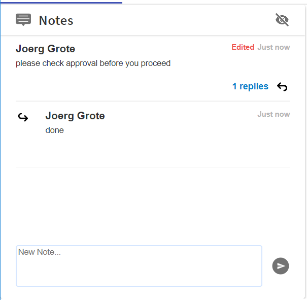

## Notes Component
This Component allows to list, and add Notes to a Case-Instance or other Context e.g. a whole Application.
Any Note can have Sub-Notes to allow real collaboration.

#### Screenshot
Screenshot Image of the Notes Component.



#### Usage
Sample usage HTML Tag

```html
<!-- just for testing -->
<tcla-live-apps-notes [relatedItemType]="CASE_APP" [relatedItemId]="1" [userId]="1"></tcla-live-apps-notes>
```

#### Inputs
available Attributes

| Attribute         | Type                          | Default Value | Comments                                        |
| ----------------- |:----------------------------- |:------------- |:----------------------------------------------- |
| relatedItemType   | string                        |               | use 'CASE_APP' to share notes with case manager |
| relatedItemId     | string                        |               | 'caseRef' for case related                      |
| userId            | string                        |               | Folder ID, case or Org.                         |


#### Demos
live Showcase

```html
<!-- as HTML within Markdown, just remove the ```html code-area ``` -->
<tcla-live-apps-notes [relatedItemType]="CASE_APP" [relatedItemId]="1" [userId]="1"></tcla-live-apps-notes>
<script type="text/javascript" src="http://host/cust-component/tcla-live-apps-notes.js"></script>
```

> Showcase connected to Mock Service


