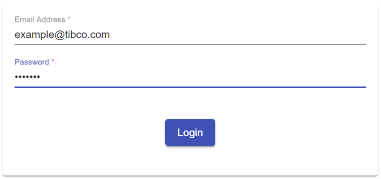

## Cloud Login Component
Generic TIBCO Cloud Login Component

#### Screenshot
Screenshot Image of the Login Dialog



#### Usage
HTML Tag to generate the login components.
```html
<tc-tibco-cloud-login></tc-tibco-cloud-login>
```

#### Outputs
available Attributes

| Attribute             | Type            | Default Value | Comments                    |
| --------------------- |:--------------- |:------------- |:--------------------------- |
| loggedIn              | boolean         |               | valid Session after login   |
| subscriptionRequired  | boolean         | false         | indicate Subscription       |

#### Demos
live Showcase

<tc-tibco-cloud-login></tc-tibco-cloud-login>
<script type="text/javascript" src="http://host/cust-component/cust-element.js"></script>

> Showcase connected to Mock Service.


