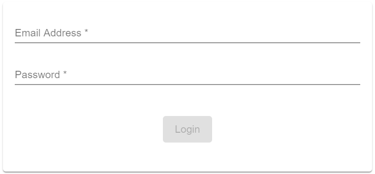

## Cloud Subscription Selection

![Status][draft] ![Component Type][top] <!--Component Meta {"created_by":"JS", "reviewed_by":"JG", "last_modified_by":"JS", "comment":"init"} Component Meta -->

In case of the User has multiple Subscription on TIBCO Cloud, this Component allows to select one of them.

#### Screenshot
Screenshot Image of the Subscription Selection Dialog



#### Usage
This component is required if user is in multiple subscriptions - they must select a subscription to complete login.

```html
<tcla-tibco-cloud-multiple-subscription *ngIf="subRequired && !loggedIn" [subscriptions]="subscriptions"
     [token]="token" (subscriptionSelection)="handleLoggedIn($event)"></tcla-tibco-cloud-multiple-subscription>
```

!!! info
    A user will use this component when they have multiple subscriptions. The component is passed a list of subscriptions. The user must choose a subscription, then the user is logged in against that subscription.

#### Inputs
available Attributes

| Attribute       | Type            | Default Value | Comments              |
| --------------- |:--------------- |:------------- |:--------------------- |
| subscriptions   | any             |               | List of Subscriptions |
| token           | AccessToken     |               | Cloud AccessToken     |

#### Outputs
available Attributes

| Attribute              | Type            | Default Value | Comments              |
| ---------------------- |:--------------- |:------------- |:--------------------- |
| loggedIn               | boolean         |               | user is logged in ok  |
| subscriptionSelection  |                 |               | selected Subscription |

#### Demos
live Showcase

<tc-tibco-cloud-multiple-subscription></tc-tibco-cloud-multiple-subscription>
<script type="text/javascript" src="http://host/cust-component/cust-element.js"></script>

> Showcase connected to Mock Service 

[auto]: https://img.shields.io/badge/Status-auto%20generated-lightgrey.svg?style=flat "auto generated"
[manually]: https://img.shields.io/badge/Status-manually%20created-yellow.svg?style=flat "manually created"
[draft]: https://img.shields.io/badge/Status-draft-red.svg?style=flat "draft"
[review]: https://img.shields.io/badge/Status-need%20review-yellowgreen.svg?style=flat "need review"
[review done]: https://img.shields.io/badge/Status-review%20done-green.svg?style=flat "review done"
[finalized]: https://img.shields.io/badge/Status-finalized-brightgreen.svg?style=flat "finalized"

[top]: https://img.shields.io/badge/Component%20Type-Top-blue.svg?style=flat "top Component"
[major]: https://img.shields.io/badge/Component%20Type-major%20Component-blue.svg?style=flat "major Component"
[minor]: https://img.shields.io/badge/Component%20Type-minor%20Component-blue.svg?style=flat "minor Component"

