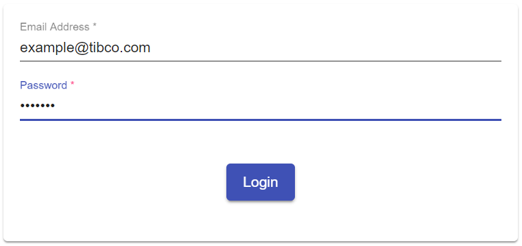

## Login Component

![Status][draft] ![Component Type][top] <!--Component Meta {"created_by":"JS", "reviewed_by":"JG", "last_modified_by":"JS", "comment":"init"} Component Meta -->

Component perfrom a Login in case there is no valid Session yet.

#### Screenshot
Screenshot Image of the Login Dialog



#### Usage
to place a Login Dialog inside your App just use the following HTML Tag:

```html
<tcla-live-apps-login></tcla-live-apps-login>
```

If the user is not logged in the login component will be displayed automatically.
In Case the user is in multiple subscriptions - they must select a subscription to complete login.

#### Outputs
available Attributes

| Attribute       | Type            | Default Value | Comments                  |
| --------------- |:--------------- |:------------- |:------------------------- |
| loginContext    | LoginContext    |               | valid Session after login |
| loggedIn        | boolean         | false         | indicate valid Session    |

#### Demos
Showcase placeholder

<tcla-live-apps-login></tcla-live-apps-login>
<script type="text/javascript" src="http://host/cust-component/cust-element.js"></script>

> Showcase connected to Mock Service

[auto]: https://img.shields.io/badge/Status-auto%20generated-lightgrey.svg?style=flat "auto generated"
[manually]: https://img.shields.io/badge/Status-manually%20created-yellow.svg?style=flat "manually created"
[draft]: https://img.shields.io/badge/Status-draft-red.svg?style=flat "draft"
[review]: https://img.shields.io/badge/Status-need%20review-yellowgreen.svg?style=flat "need review"
[review done]: https://img.shields.io/badge/Status-review%20done-green.svg?style=flat "review done"
[finalized]: https://img.shields.io/badge/Status-finalized-brightgreen.svg?style=flat "finalized"

[top]: https://img.shields.io/badge/Component%20Type-Top-blue.svg?style=flat "top Component"
[major]: https://img.shields.io/badge/Component%20Type-major%20Component-blue.svg?style=flat "major Component"
[minor]: https://img.shields.io/badge/Component%20Type-minor%20Component-blue.svg?style=flat "minor Component"
