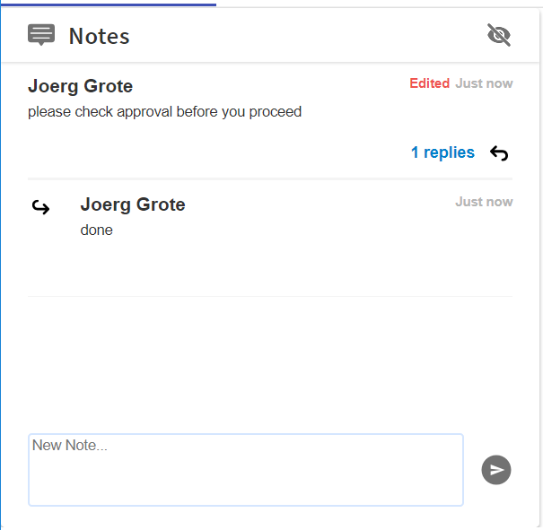

## Notes Component

![Status][draft] ![Component Type][top] <!--Component Meta {"created_by":"JS", "reviewed_by":"JG", "last_modified_by":"JS", "comment":"init"} Component Meta -->

This Component allows to list, and add Notes to a Case-Instance or other Context e.g. a whole Application.
Any Note can have Sub-Notes to allow real collaboration.

#### Screenshot
Screenshot Image of the Notes Component.



#### Usage
Sample usage HTML Tag

```html
<!-- just for testing -->
<tcla-live-apps-notes [relatedItemType]="CASE_APP" [relatedItemId]="1" [userId]="1"></tcla-live-apps-notes>
```

#### Inputs
available Attributes

| Attribute         | Type                          | Default Value | Comments                                        |
| ----------------- |:----------------------------- |:------------- |:----------------------------------------------- |
| relatedItemType   | string                        |               | use 'CASE_APP' to share notes with case manager |
| relatedItemId     | string                        |               | 'caseRef' for case related                      |
| userId            | string                        |               | Folder ID, case or Org.                         |


#### Demos
Showcase placeholder

```html
<!-- as HTML within Markdown, just remove the ```html code-area ``` -->
<tcla-live-apps-notes [relatedItemType]="CASE_APP" [relatedItemId]="1" [userId]="1"></tcla-live-apps-notes>
<script type="text/javascript" src="http://host/cust-component/tcla-live-apps-notes.js"></script>
```

> Showcase connected to Mock Service later

[auto]: https://img.shields.io/badge/Status-auto%20generated-lightgrey.svg?style=flat "auto generated"
[manually]: https://img.shields.io/badge/Status-manually%20created-yellow.svg?style=flat "manually created"
[draft]: https://img.shields.io/badge/Status-draft-red.svg?style=flat "draft"
[review]: https://img.shields.io/badge/Status-need%20review-yellowgreen.svg?style=flat "need review"
[review done]: https://img.shields.io/badge/Status-review%20done-green.svg?style=flat "review done"
[finalized]: https://img.shields.io/badge/Status-finalized-brightgreen.svg?style=flat "finalized"

[top]: https://img.shields.io/badge/Component%20Type-Top-blue.svg?style=flat "top Component"
[major]: https://img.shields.io/badge/Component%20Type-major%20Component-blue.svg?style=flat "major Component"
[minor]: https://img.shields.io/badge/Component%20Type-minor%20Component-blue.svg?style=flat "minor Component"
